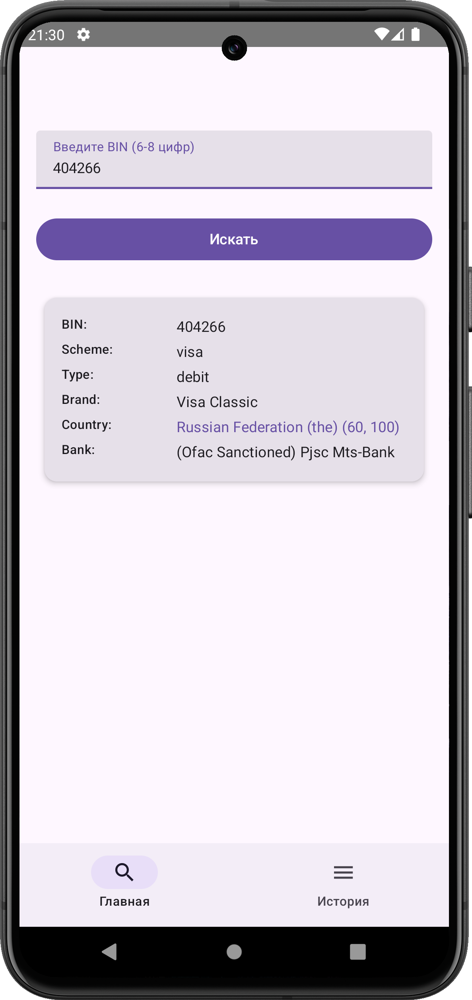
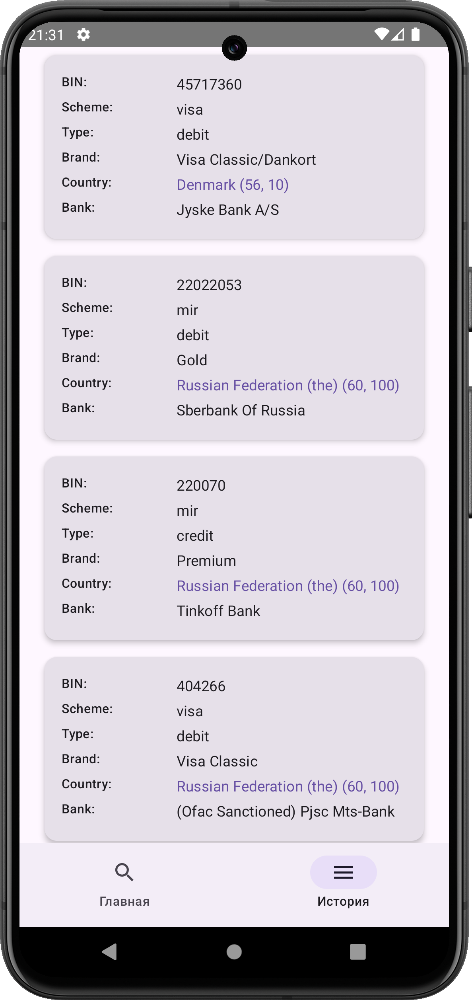

# BIN Lookup App

Простое Android-приложение для поиска информации о BIN (Bank Identification Number) через публичное API [binlist.net](https://binlist.net).  
Позволяет просматривать информацию о банке и сохраняет историю запросов.

---

## Скриншоты

| Главный экран | История запросов |
|---------------|------------------|
|  |  |

---

## Функциональность

- Ввод BIN и получение информации о карте/банке
- Переход по ссылке сайта банка в браузер
- Звонок по номеру банка
- Открытие координат страны в карте
- Локальное хранение истории запросов
- Современный UI с использованием Jetpack Compose

---

## Архитектура

Проект построен по принципам **Clean Architecture** с разделением на слои:

- `data` – доступ к API и локальной базе
- `domain` – бизнес-логика и use cases
- `presentation` – UI-слой с ViewModel и Compose
- Используются **UDF-подход** и **Single Source of Truth**

---

## Стек технологий

- Язык: **Kotlin**
- UI: **Jetpack Compose**
- Архитектура: **MVVM + Clean Architecture**
- Dependency Injection: **Hilt**
- Хранение данных: **Room**
- Работа с состоянием: **StateFlow**
- Навигация: **Navigation Compose**
- Обработка ошибок и состояний: **sealed классы**, **UiState**

---

## API

Приложение использует открытое API от [https://binlist.net](https://binlist.net)  
Пример запроса:  
`https://lookup.binlist.net/45717360`

---

## Как запустить

1. Клонируйте проект:
   ```bash
   git clone https://github.com/stepchik003/BinInfo.git
